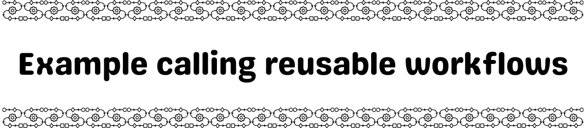

<picture>
    <source 
        media="(prefers-color-scheme: dark)"
        srcset="documentation/dark-banner.png"
    >
    <source
        media="(prefers-color-scheme: light)"
        srcset="documentation/light-banner.png"
    >
    
</picture>

Repository showing an example of a workflow that calls a reusable workflows.

Read the related blog post here: [Reusable GitHub Workflows](https://www.keracudmore.dev/posts/2025-03-24/) 
